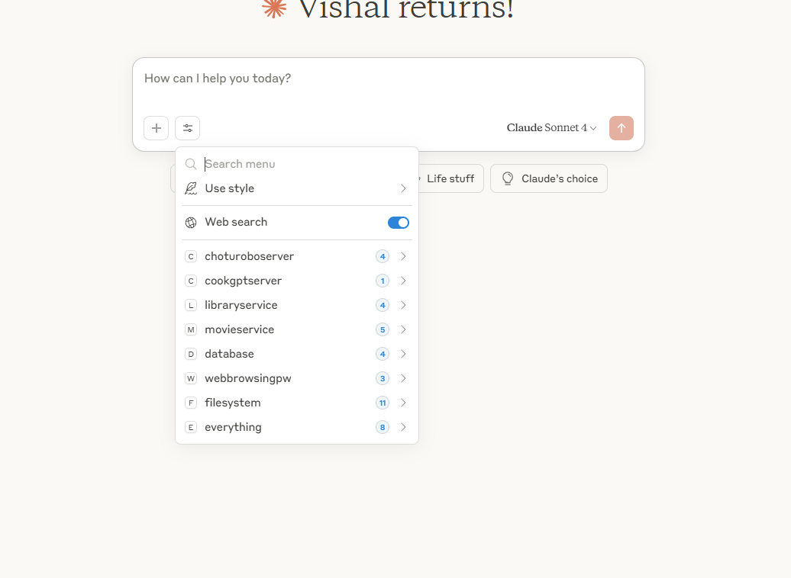
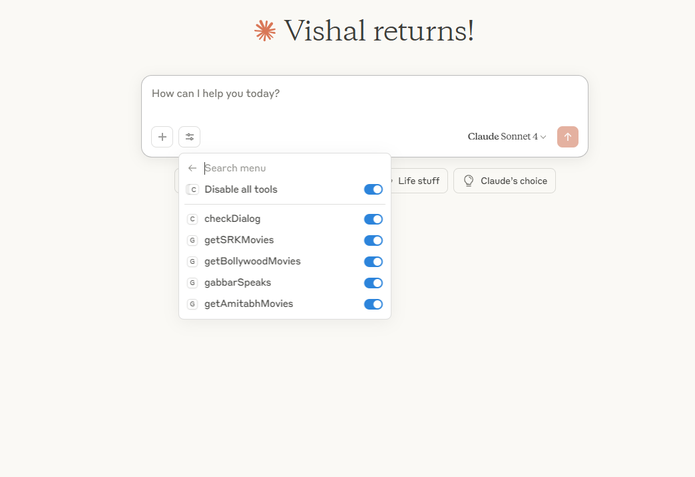
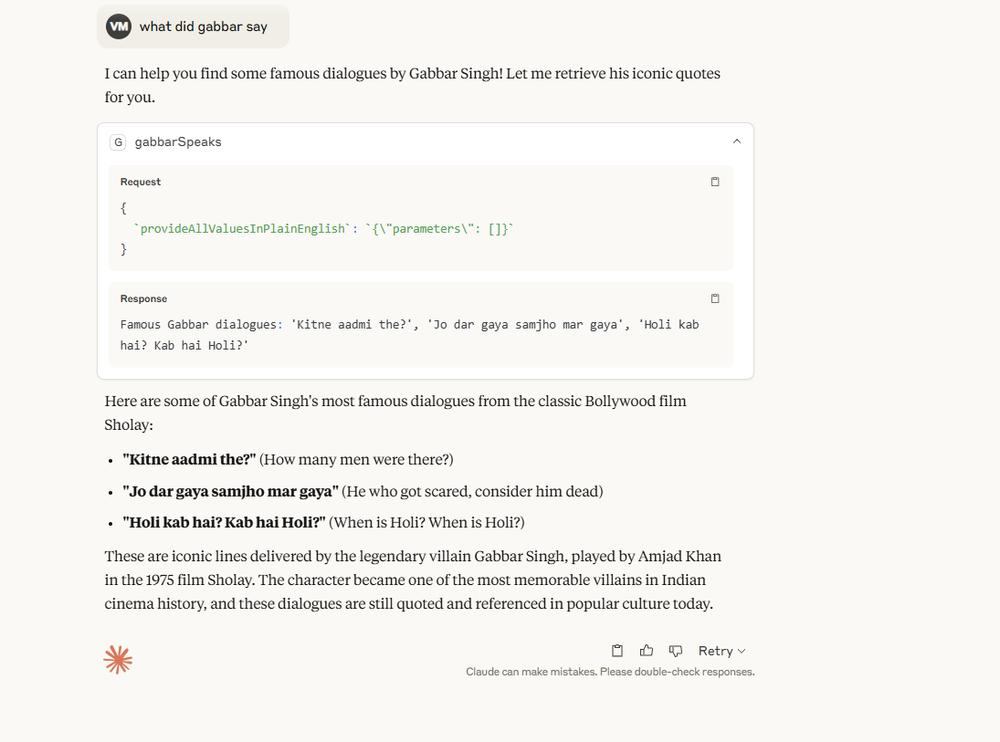

# Multi-Server MCP and A2A Implementation

This project implements two separate servers:
1. Movies Server (Port 7861)
2. Library Server (Port 7862)

## Starting the Servers


### Movies Server
To start the Movies server, run:

```bash
mvn spring-boot:run -Pmovies 
```

The Movies server will start on port 7861: http://localhost:7861

Note: Specifying profile with the main class is important as there are multiple Spring Boot applications in the project.

The Movie servers starts with its own application properties

```
@SpringBootApplication
@EnableAgent
@PropertySource("classpath:application-movies.properties")
public class MoviesServer {

    public static void main(String[] args) {

        SpringApplication.run(MoviesServer.class, args);
    }
}


```

This application properties has its own tools4ai properties file which is used to configure the actions for the Movies server.

```properties
tools4ai.properties.path=tools4ai_movies.properties
```

The `tools4ai_movies.properties` file contains the configuration for the actions specific to the Movies server, such as:

```properties
action.packages.to.scan=example.movies.server
```
and all the actions defined in the `example.movies.server` package will be scanned and registered as tools.

```
package example.movies.server;

import com.t4a.annotations.Action;
import com.t4a.annotations.Agent;
import com.t4a.detect.ActionCallback;
import com.t4a.processor.AIProcessor;
import lombok.extern.slf4j.Slf4j;
import org.springframework.stereotype.Service;

@Service
@Agent(groupName = "movieOperations", groupDescription = "Manage Bollywood movie operations like getting movie lists and famous dialogues")
@Slf4j
public class MoviesService {

    private ActionCallback callback;
    private AIProcessor processor;

    public MoviesService() {
        log.info("Created Movies Service");
    }

    @Action(description = "Get a list of popular Bollywood movies")
    public String getBollywoodMovies() {
        log.info("Fetching Bollywood movies list");
        return "Popular Bollywood Movies: DDLJ, Sholay, Mother India, Mughal-e-Azam, PK";
    }

    @Action(description = "Get movies starring Shah Rukh Khan")
    public String getSRKMovies() {
        log.info("Fetching SRK movies");
        return "SRK Movies: DDLJ, Chennai Express, Pathaan, Chak De India, My Name Is Khan";
    }

    @Action(description = "Get movies starring Amitabh Bachchan")
    public String getAmitabhMovies() {
        log.info("Fetching Amitabh Bachchan movies");
        return "Amitabh Movies: Sholay, Deewar, Zanjeer, Don, Agneepath";
    }

    @Action(description = "Check if a given dialog is from a movie")
    public String checkDialog(String dialog) {
        log.info("Checking dialog: '{}'", dialog);
        if (dialog.contains("Mogambo")) {
            return "This is from Mr. India";
        } else if (dialog.contains("Kitne aadmi the")) {
            return "This is from Sholay";
        } else {
            return "Dialog not recognized";
        }
    }

    @Action(description = "Get famous dialogues by Gabbar Singh")
    public String gabbarSpeaks() {
        log.info("Getting Gabbar's dialogues");
        return "Famous Gabbar dialogues: 'Kitne aadmi the?', 'Jo dar gaya samjho mar gaya', 'Holi kab hai? Kab hai Holi?'";
    }
}

```


### Library Server
To start the Library server, run:
```bash
mvn spring-boot:run -Plibrary 
```

You can also provide tools properties file using application properties
``` 
spring.application.name=spring-boot
server.port=7862
a2a.persistence=cache
tools4ai.properties.path=tools4ai_library.properties
```


As you can see both the servers have there individual tools4ai properties file 
each file has  a separate  action.packages.to.scan.
So the movie serer adds actions from the movie package and the library server adds actions from the library package.

``` 
action.packages.to.scan=example.movies.server
```

The Library server will start on port 7862: http://localhost:7862





## MCP Server and Client Example

This server is designed to work as both an A2A (Agent-to-Agent) and MCP (Model Context Protocol) server:
- A2A: Google's Agent-to-Agent protocol for communication between AI agents
- MCP: Model Context Protocol for interaction with AI models and tools

The server can connect to any client using either protocol. Additionally, Java client implementations for both protocols are included in this repository for testing purposes.

### Java Clients

Two Java client implementations are available in the `src/main/java/org/example/client` package:
1. `A2AClient.java` - Google's Agent-to-Agent protocol implementation for AI agent communication
2. `MCPClient.java` - Model Context Protocol implementation for AI model interactions

You can use either client based on your protocol needs.


### Testing with curl commands

You can use curl commands to test both servers. Each server has its own set of services and runs on different ports:
- Movies Server (Port 7861): Provides movie-related actions through `MoviesService`
- Library Server (Port 7862): Provides library-related actions through `LibraryService`

### Get the list of tools

For Movies Server (Port 7861):
```bash
curl -H "Content-Type: application/json" `
-d '{"jsonrpc":"2.0","method":"tools/list","params":{},"id":9}' `
http://localhost:7861/
```

For Library Server (Port 7862):
```bash
curl -H "Content-Type: application/json" `
-d '{"jsonrpc":"2.0","method":"tools/list","params":{},"id":9}' `
http://localhost:7862/
```

### Call tools examples

Example: Call a movie-related tool (Port 7861):
```bash
curl -H "Content-Type: application/json" `
-d '{
"jsonrpc": "2.0",
"method": "tools/call",
"params": {
"name": "rentMovie",
"arguments": {
"provideAllValuesInPlainEnglish": {
"name": "The Dark Knight",
"user": "John Doe"
}
}
},
"id": 25
}' `
http://localhost:7861/
```

Example: Call a library-related tool (Port 7862):
```bash
curl -H "Content-Type: application/json" `
-d '{
"jsonrpc": "2.0",
"method": "tools/call",
"params": {
"name": "holdBook",
"arguments": {
"provideAllValuesInPlainEnglish": {
"name": "harry potter and the prisoner of azkaban",
"user": "Vishal Mysore"
}
}
},
"id": 25
}' `
http://localhost:7862/
```

Note: Make sure you're using the correct port number for the server you want to interact with. The Movies server runs on port 7861 and provides movie-related actions through MoviesService, while the Library server runs on port 7862 and provides library-related actions through LibraryService.


for a2a

curl -u http://localhost:7861/.well-known/agent.json


## Connect to Claude Desktop
Configure Claude Desktop Client
Locate your Claude configuration file:

```json
 C:\Users\<yourusername>\AppData\Roaming\Claude\claude_desktop_config.json
```
Add the following server configuration to the file:

```json
   "mycustomserver": {
     "command": "java",
     "args": [
       "-jar",
       "PATH_TO_YOUR_JAR/mcp-connector-full.jar",
       "http://localhost:7861"
     ],
     "timeout": 30000
   }

```

You can downoad the `mcp-connector-full.jar` from the releases section of this repository. [Here](https://github.com/vishalmysore/mcp-connector/releases/download/release2/mcp-connector-full.jar)
Download the MCP Connector
Download the MCP Connector JAR. This is a mandatory component that enables communication between your client and server for MCP protocol , for A2A this is not required.


if the above file is empty then you have add in this way
```
{
"mcpServers": {
"mycustomserver": {
"command": "java",
"args": [
"-jar",
"PATH_TO_YOUR_JAR/mcp-connector-full.jar",
"http://localhost:7862"
],
"timeout": 30000
}
}
}
```

